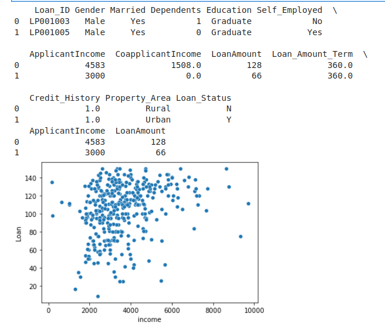

# Implementation of K-Means Clustering Algorithm
## Aim
To write a python program to implement K-Means Clustering Algorithm.
## Equipment’s required:
1.	Hardware – PCs
2.	Anaconda – Python 3.7 Installation

## Algorithm:


###Step1:
import the necessary packages.

###Step2:
Read the csv file.

###Step3:
Scatter plot the applicant income and loan amount.

###Step4:
Obtain the kmean clustring for 2 classes.

###Step5:
Pretict the cluster group of Applicant Income and Loanamount.

<br>

## Program:
```python
##devaloped by:Saileshkumar A
##register number:22003843
import pandas as pd
import matplotlib.pyplot as plt
from sklearn. cluster import KMeans
import seaborn as sns 
import warnings
warnings.filterwarnings('ignore')

data=pd.read_csv('clustering.csv')
print(data.head(2))

x1=data.loc[:,['ApplicantIncome','LoanAmount']]
print(x1.head(2))

X=x1.values
sns.scatterplot(X[:,0],X[:,1])
plt.xlabel('income')
plt.ylabel('Loan')
plt.show()

kmean=KMeans(n_clusters=4)
kmean.fit(x)
print('cluster clusters:',kmean.cluster_centers_)
print('labels:',kmean.labels_)
      
predicted_cluster=kmean.predict([[9200,110]])
print('The cluster group for the Application 9200 and loan a  Ammount 110 is',predicted_cluster)

```
## Output:


## Result
Thus the K-means clustering algorithm is implemented and predicted the cluster class using python program.
